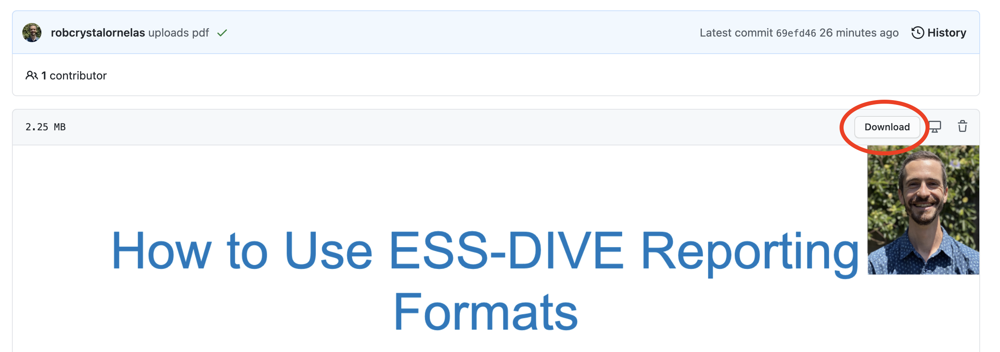

# The ESS-DIVE Community Data Workshop 2021  

This is a repository that has all presentations from **ESS-DIVE's 2021 Community Data Workshop** 

## Quick start guide  

- Click [here](https://ess-dive.lbl.gov/community-data-workshop/) to see the 2021 workshop agenda.
- The Community Workshop was organized into 5 sessions that took place on May 24 & 25 from 9am-2pm PST (12pm-5pm EST). 
- Each folder in this repository includes PDF files of slides from all presentations that can be viewed in the GitHub interface or downloaded to your computer (see below for more detailed instructions).

# Viewing and downloading presentation PDFs

1. select the folder corresponding to the session whose content you want to view.
  

2. Click the link to the PDF of the presentation  
  

3. Then, you can scroll down this page to view the presentation, or click the `download` button to save the PDF to your computer.  
 
